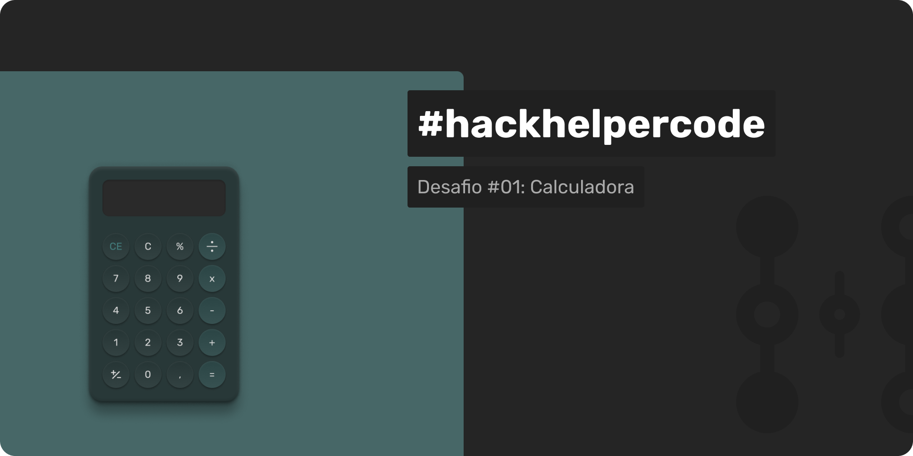

# Desafio 01 - Calculadora

> **EN:** **[Click here to access English README version.](README.en.md)**

Neste desafio, seu objetivo é construir uma calculadora funcional a partir de um design pré-definido. O projeto busca testar suas habilidades em implementar interfaces e lógica de programação básica, como operações matemáticas simples. A calculadora deve ser capaz de realizar as operações de adição, subtração, multiplicação e divisão.

## Funcionalidades Principais:
- Realizar operações básicas de adição.
- Implementar a função de subtração.
- Desenvolver a funcionalidade de multiplicação.
- Criar a função de divisão.
- Interface baseada em um design predefinido.

## Tecnologias Sugeridas:
> Abaixo, listamos algumas sugestões que podem ser úteis para a realização do desafio. Sinta-se à vontade para utilizar a tecnologia que mais lhe agrada:
- **HTML/CSS/JavaScript**: Ideal para criar uma aplicação web simples e funcional.
- **React.js**: Facilita a criação de interfaces dinâmicas e pode ser uma boa escolha para esse projeto.
- **Vue.js**: Outra excelente opção para quem gosta de trabalhar com frameworks JavaScript modernos.

## Link de Acesso:
- **Figma:** [Clique aqui e tenha acesso ao design no Figma.](https://www.figma.com/community/file/1205585056640229128/hackhelpercode-desafio-1)
- **Repositório:** [Clique aqui e tenha acesso ao repositório com README.](https://github.com/helperdevchallenges/calculator.git)

## Extras:
> Você poderá alterar o design, modificando cores e adicionando novas funcionalidades. Caso queira, utilize o checklist abaixo para avaliar sua solução.
### Checklist de Avaliação:
- [ ] Organização do código (legibilidade, estrutura de arquivos, comentários).
- [ ] Aplicação consistente do design proposto.
- [ ] Criatividade na resolução e implementação das funcionalidades.
- [ ] Tecnologias bem aplicadas e justificadas.
- [ ] Funções retornando os valores esperados.
- [ ] Considerações para a experiência do usuário final (UX).

### Créditos
- Criado por [HelperDev Brasil](https://www.helperdev.com.br/).
- Participe da nossa comunidade no [Discord](https://discord.gg/8QHmVYWjgc).